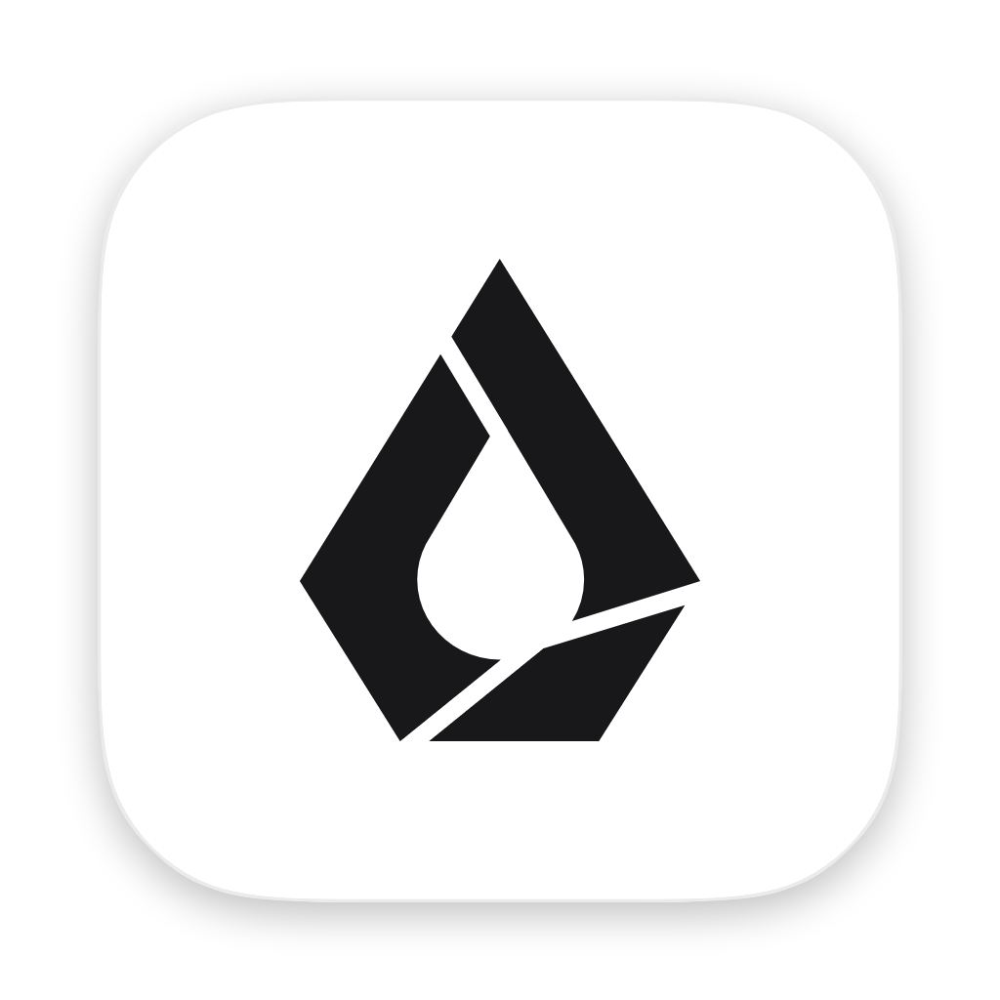
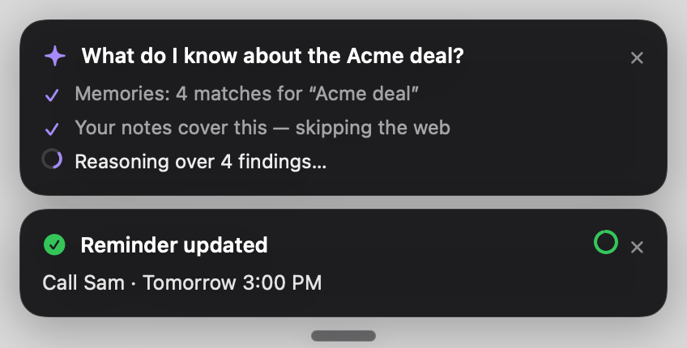

<p align="center"></p>

<h1 align="center">Flow</h1>
<p align="center"><b>Talk to your Mac.</b> An on-device voice agent built on Liquid AI's LFM2.5 models.</p>

Hold a key, speak, let go. Flow transcribes you with **LFM2.5-Audio-1.5B**, understands what you meant with
**LFM2.5-2.6B**, and acts: answers questions from your own memories and the web, sets and edits reminders, writes
emails into the field you're in, opens apps, and transcribes meetings into notes and commitments. Speech
recognition, the agent and memory search all run locally through llama.cpp.

<p align="center"></p>

## What it does

| Hold **⌃ Control** and say… | Flow |
|---|---|
| "Remember Marcus from Acme prefers email" | saves a memory (only when you say *remember*) |
| "What do I know about the Acme deal?" | searches memories, meetings, reminders and emails it wrote, reasons over what it found, answers, and shows its steps live |
| "Who won the Champions League last year?" | searches the web |
| "Remind me to send the proposal Thursday at 3pm" · "Actually make it 5" | creates the reminder, then moves it |
| "Write an email here telling Kevin my submission is in" | composes it and types it into the focused field |
| "Email Priya asking for the signed contract" | drafts it in Mail (never sends) |
| "Insert: running ten minutes late" | types exactly that |
| "Open Spotify" · "Click the send button" | acts on your Mac |
| "Play Only Time by Enya" · "Open my roadmap page in Notion" · "Ask Claude to explain DNS" | acts inside your apps (see [App control](#app-control)) |
| "Update my memory about Marcus, his email changed" · "Forget where I parked" | edits or deletes memories |

- **Double-tap ⌃** to start or stop transcribing a meeting. You get a summary, decisions, and your commitments as suggested reminders.
- **Hold ⌥ Option** to dictate: plain transcription pasted where your cursor is, with no agent involved.
- **Multi-step conversation:** follow-ups like "and tomorrow?", "make it 3pm" or "just that, nothing else" are resolved against the last 15 turns.
- **Calendar** (week view) and **Feed** of everything Flow did, with editable reminders and memories.
- **System Prompt** tab: edit the personality and every instruction Flow gives the model.
- **Tools & Permissions:** set each tool to *Always*, *Ask first* or *Off*.

## App control

Flow can act inside your apps, not just open them. Say what you want (naming the app helps, e.g. "…on Spotify",
"…in Chrome") and Flow picks the matching action.

### Built-in actions

| App | Actions | Say, for example |
|---|---|---|
| **Spotify** | play a song, album, artist, playlist or genre by name · play your own playlists or Liked Songs · resume · pause · next · previous · volume (level, up, down, mute) · shuffle on/off · repeat on/off · what's playing | "Play Only Time by Enya" · "Play my Work playlist" · "Skip this song" · "Turn it down" · "What song is this?" |
| **Notion** | open a page by name · search · new page (with title and text) · back · forward · show/hide sidebar · copy page link · new tab · light/dark mode | "Open my roadmap page in Notion" · "Make a new page called Meeting notes" · "Hide the sidebar" |
| **Claude** | ask (new chat, types and sends your message; "ask Claude about this" includes your selected text) · new chat | "Ask Claude to explain how DNS works" · "Have Claude summarize this" |
| **Mail** | check for new mail · unread summary (count and senders) · reply to the selected email (drafted, **never sent**) · search | "Do I have any unread emails in Mail?" · "Reply to this email saying I'll be there at noon" |
| **Google Chrome** | open a site in a new tab · Google search · switch to an open tab by name · new tab · close tab · reload · back · forward · incognito window · copy page link | "Go to github.com" · "Switch to my Gmail tab" · "Google flights to Tokyo" |
| **Notes** | create a note (title and text) · add to an existing note · open a note | "Create a note in Notes called packing list with passport and charger" · "Add bread to my groceries note" |
| **Whatever is playing** | play/pause · next · previous (media keys, any player) | "Pause" · "Next" |

### Discovered on your Mac

Beyond the built-in actions, Flow finds more on its own:

- **Menu commands** of the app in front, e.g. "toggle the sidebar", "new window", "zoom in". Every Mac app has these,
  native or Electron.
- **AppleScript commands** that take no arguments, from every scriptable app installed (Music, TV, QuickTime,
  Photos, Keynote…), e.g. "next track in Music", "new screen recording".
- **Your Shortcuts**, e.g. "run my Make GIF shortcut". Anything the Shortcuts app can do, Flow can trigger.

Run `.build/debug/Flow --apps` to list every action available on your Mac.

### Safety

- Commands that delete, send, quit or sign out ask first.
- Mail replies and drafts are never sent.
- Flow never launches an app you didn't name just to run one of its commands.
- AppleScript gets your words as arguments; they're never pasted into scripts.

### Limits

- **Spotify without an API key** reads Spotify's window: it presses play on Spotify's top result, which Spotify
  personalizes (name the artist when it matters), and it finds only playlists visible in your library sidebar. It
  expects Spotify's interface in English.
- **Notion and Claude** aren't scriptable, so Flow drives them with their keyboard shortcuts; an app update that
  changes a shortcut can break an action.
- Queue, saving songs, adding to playlists and choosing a speaker need a Spotify login, which isn't built yet.

## Requirements

- Apple Silicon Mac, macOS 14 or later, 16 GB RAM recommended
- Xcode Command Line Tools (Swift 5.9+): `xcode-select --install`
- [Homebrew](https://brew.sh) and llama.cpp: `brew install llama.cpp`
- ~3.6 GB of disk space for the models

## Install

```bash
git clone https://github.com/james-pratama/flow-by-liquid.git
cd flow-by-liquid
scripts/download-models.sh             # LFM2.5 GGUFs from Hugging Face → ~/Library/Application Support/Flow/models
scripts/create-signing-identity.sh     # optional, recommended: keeps macOS permissions across rebuilds
scripts/build-app.sh --open            # builds, installs /Applications/Flow.app, opens it
```

On first launch Flow opens **Tools & Permissions**. Grant:

- **Microphone** and **Input Monitoring** (required; without Input Monitoring the hotkeys only work while Flow is in front)
- **Accessibility** to type and press buttons for you
- **Screen & System Audio Recording** to capture the other side of calls
- **Calendars** to see your meetings
- **Location** for "near me" answers

If a permission won't stick, make sure only one Flow.app exists, then reset it with
`tccutil reset All ai.liquid.flow` and grant again.

Optional: add a [Brave Search](https://brave.com/search/api/) API key in **Settings → Web search** for full web
results. Without one, Flow uses DuckDuckGo's HTML results and falls back to Wikipedia.

Optional: add a Spotify client ID and secret (create a free app at [developer.spotify.com](https://developer.spotify.com/dashboard))
in **Settings → Spotify** so "play <song>" starts the exact track. Without them, Flow opens Spotify's search and presses
play on the top result (Spotify personalizes that ranking, so name the artist — "Only Time by Enya" — when it matters).
"Play my Work playlist" and "play my Liked Songs" play from your library sidebar either way.

The first time Flow controls an app through AppleScript, macOS asks you to allow it (**Privacy & Security → Automation**).

## How it works

```
hotkey ─► mic (16 kHz) ─► LFM2.5-Audio (ASR, :8182)
       ─► conversation resolver (follow-ups → self-contained request)
       ─► router: one constrained LFM2.5-2.6B call (:8181) + deterministic harness corrections
       ─► tools (policy + permission checks) ─► SQLite entry ─► bottom card
```

- **Router harness** (`Engine/Router.swift`): LFM2.5-2.6B is a reasoning model. Flow builds the ChatML prompt itself, prefills an empty `<think></think>` for speed, and constrains the output with a JSON schema. The model first picks a descriptive *kind*, and the schema then only allows that kind's tools. Deterministic rules fix known failure modes; for example, a call is dropped when its trigger words were never spoken.
- **App control** (`Tools/AppCatalog.swift`, `Tools/CuratedApps.swift`): the router only decides that something should happen
  *inside* an app (`app_action(app, request)`). A catalog search narrows every action Flow knows to 8 candidates
  (embeddings + keywords), and a second constrained call picks one and fills its arguments; the schema allows only
  those 8 or "none". The catalog has two parts:
  - **Curated** actions for Spotify, Notion, Claude, Mail, Google Chrome and Notes (plus media keys), which can
    chain steps, e.g. search Spotify → play the exact track.
  - **Discovered** actions, found on your Mac automatically: parameterless AppleScript commands from every scriptable
    app, every item in the front app's menu bar, and your Shortcuts.

  Commands that delete, send, quit or sign out ask first. AppleScript values are passed as `argv`, never spliced
  into scripts.
- **Questions** (`Tools/QuestionTool.swift`) run a small agent loop: memory search → planner picks the next step (search again, files, web, or answer) → the model's own reasoning over the findings → answer. Each step appears live on a card.
- **Memory** (`Store/`): SQLite with FTS5 plus LFM2.5-Embedding-350M vectors, fused with reciprocal-rank fusion. `MemoryProvider` is the interface to swap in synced or OEM storage.
- **Dates** are never computed by the model. It copies the spoken phrase, and `DateResolver` does the calendar math.

### Evals

```bash
swift build
.build/debug/Flow --eval evals/router_cases.jsonl     # tuning set
.build/debug/Flow --eval evals/router_holdout.jsonl   # held out
.build/debug/Flow --app-eval evals/app_cases.jsonl    # app control: does the request pick the right action?
```

On an M-series Mac with Q4_K_M: **100%** on the tuning set (67 cases), **~96%** on the held-out set, and **100%**
on the 38 app-control cases (the action pick adds about 250 ms). Routing takes about 500 ms p50; speech recognition adds about 100–200 ms.

Other headless commands, handy for development (`FLOW_HOME` points data at a scratch folder; `FLOW_DRY_RUN=1` stops tools from touching your apps):

```bash
FLOW_DRY_RUN=1 FLOW_HOME=/tmp/flow .build/debug/Flow --handle "remind me to call Sam at 4pm"
.build/debug/Flow --route "open spotify" [--focused]
.build/debug/Flow --apps [filter]                          # every app action Flow knows on this Mac
FLOW_DRY_RUN=1 .build/debug/Flow --app "skip this song" Spotify   # which action a request picks
.build/debug/Flow --asr recording.wav
.build/debug/Flow --ask "where did I park?"
.build/debug/Flow --meeting transcript.txt "Acme call"     # lines like "Me: …" / "Them: …"
.build/debug/Flow --meeting-sim call.wav                   # plays audio through the real meeting recorder
```

`scripts/run-servers.sh` keeps the three model servers warm across rebuilds; Flow reuses healthy servers on ports 8181–8183.

## Project layout

| Folder | Contents |
|---|---|
| `App/` | App delegate, menu bar, settings, editable prompts |
| `Capture/` | Hotkeys (talk / dictate / double-tap), mic, system audio, focus + Accessibility helpers |
| `Engine/` | Model servers, LLM client, ASR, router + prompt, conversation resolver, dates, location, pipeline |
| `Tools/` | Memory, reminders, questions, write-here, paste, open app, press button, Mail drafts, meetings, app control (catalog, curated apps, AppleScript / keys / menus / Shortcuts) |
| `Store/` | SQLite, search index, memory provider |
| `Scheduler/` | Reminder firing, calendar watcher, meeting recorder and notes |
| `Overlay/` | Bottom pill and stacked cards with countdowns and live steps |
| `UI/` | Calendar, Feed, System Prompt, Tools & Permissions, Settings, theme, logo |

## Credits and licenses

- Code: [MIT](LICENSE).
- Models: [Liquid AI](https://www.liquid.ai) LFM2.5 family, downloaded separately from Hugging Face under the
  [LFM Open License](https://huggingface.co/LiquidAI/LFM2.5-2.6B/blob/main/LICENSE). They aren't included in this repo.
- The Liquid name and logo are trademarks of Liquid AI.
- Runs on [llama.cpp](https://github.com/ggml-org/llama.cpp).
